# 📚 KnowledgeHub — Book Management System

> **A secure, robust, microservices-based Book Management System built around trusted identity, controlled authorization, transactional consistency, and concurrency-safe library operations.**

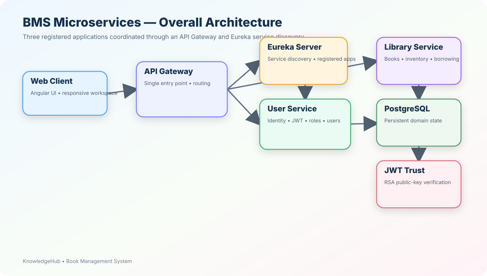

## ✨ Project at a Glance

KnowledgeHub is implemented as a **microservices architecture** with two business services:

- **User Service** — identity, authentication, authorization roles, user lifecycle, JWT issuance and token revocation.
- **Library Service** — books, authors, categories, inventory, borrowing/returning, reading history and book images.
- **API Gateway** — the common entry point through which the frontend reaches the backend services.
- **Eureka Server** — service discovery for the registered applications.
- **Angular frontend** — the user-facing application shown in the UI screenshots below.

The supplied service documentation describes the User Service as an identity authority and the Library Service as a concurrency-safe, security-first library service. The architecture therefore separates **identity ownership** from **library-domain ownership**, while allowing the library service to trust the authenticated identity carried by the JWT.

---

## 🏗️ Overall Architecture

The system follows a clear distributed-service boundary:

```text
                         ┌──────────────────────┐
                         │   Angular Frontend   │
                         │   KnowledgeHub UI    │
                         └──────────┬───────────┘
                                    │
                                    ▼
                         ┌──────────────────────┐
                         │     API Gateway      │
                         │  Routing / EntryPoint │
                         └──────────┬───────────┘
                                    │
                         ┌──────────┴───────────┐
                         ▼                      ▼
                ┌─────────────────┐    ┌─────────────────┐
                │   User Service  │    │ Library Service │
                │ Identity / JWT  │    │ Books / Borrow  │
                └────────┬────────┘    └────────┬────────┘
                         │                      │
                         ▼                      ▼
                ┌─────────────────┐    ┌─────────────────┐
                │   User Database │    │ Library DB      │
                └─────────────────┘    └─────────────────┘

                         ▲
                         │ service discovery
                  ┌──────┴──────┐
                  │ Eureka      │
                  │ Server      │
                  └─────────────┘
```

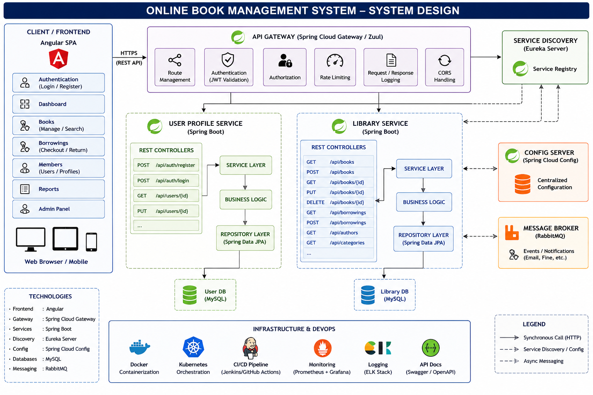

### Applications registered with Eureka

The implementation has **three applications registered in Eureka**:

| Registered application | Responsibility | Architectural role |
|---|---|---|
| **API Gateway** | Routes client requests | Single backend entry point |
| **User Service** | Authentication, users, roles, JWT | Identity authority |
| **Library Service** | Books, inventory, borrowing, images | Library business authority |

**Eureka Server** is the service registry/discovery component used by these applications; it is not counted as one of the three business applications above.


---

# 🔐 Security & Trust Model

Security is not treated as a controller-level afterthought. The User Service establishes the authenticated identity, while protected downstream operations verify that identity before applying business rules.

## Authentication

The User Service authenticates the user and issues an **RSA-signed RS256 JWT** containing identity and authorization information such as:

- `sub` — username
- `userId` — immutable user identifier
- `role` — authorization role
- `iss` — token issuer
- `aud` — intended audience
- `iat` — issued-at time
- `exp` — expiration

The User Service documentation specifies a one-hour token lifetime and explains that downstream services validate the RSA signature using the corresponding public key.

## Authorization

Authentication answers:

> **Who is the caller?**

Authorization answers:

> **What is that authenticated caller allowed to do?**

The design separates these concerns:

```text
Signed JWT
   │
   ▼
RSA verification
   │
   ▼
Role conversion
   │
   ▼
Spring Security authority
   │
   ▼
Business authorization
   │
   ├── USER → personal/read/borrow capabilities
   └── ADMIN/LIBRARIAN → management/reporting capabilities
```

For user-owned resources, authorization is based on the **`userId` extracted from the validated JWT**, rather than trusting a caller-supplied user ID.

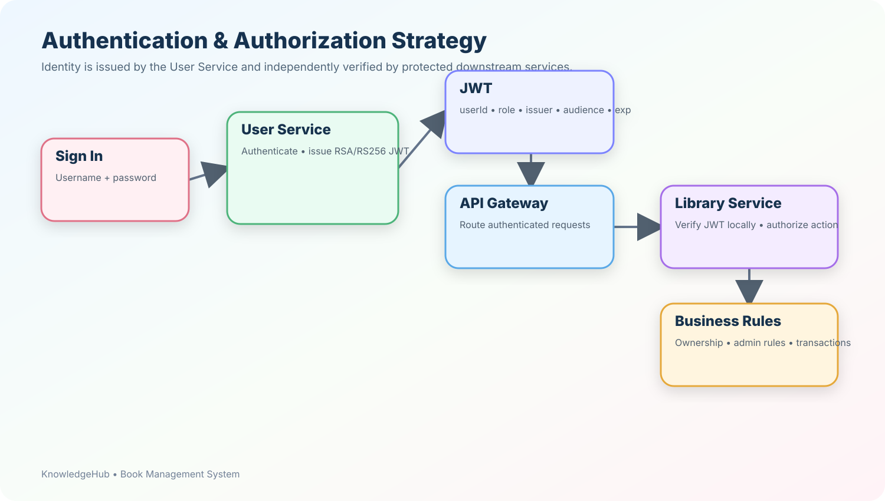

---

# 🧩 Why Microservices?

The project deliberately separates two business domains.

### User Service owns identity

```text
Users
Credentials
Roles
Authentication
JWT issuance
Logout / revocation
User authorization context
```

### Library Service owns library state

```text
Books
Authors
Categories
Inventory
Borrowings
Book images
Search
Reading / borrowing history
```

This avoids making the Library Service responsible for passwords or user credential storage.

When the Library Service needs user profile information, the supplied documentation describes **OpenFeign** integration with Bearer-token propagation. The library service keeps the borrower ID as domain data while the User Service remains the owner of profile information.

---

# 🚦 Request Processing Strategy

A protected request conceptually follows:

```text
Browser
  │
  │ Bearer JWT
  ▼
API Gateway
  │
  │ route
  ▼
Target Microservice
  │
  ├── authenticate
  ├── authorize
  ├── validate request
  ├── execute business rule
  ├── run transaction
  └── persist state
```

The Library Service documentation specifically describes local JWT verification using Spring Security Resource Server rather than making a synchronous User Service validation request for every protected API call.

This keeps the common request path **stateless and independent of a per-request authentication round trip**.

---

# 🏆 What Makes the Implementation Robust?

## 1. Database-backed concurrency control

Borrowing is not implemented as a simple:

```text
read availability
      ↓
if available
      ↓
decrement
```

Instead, the target book row is protected with a **pessimistic write lock** while the business decision is made.

```text
Request A ──────┐
                ▼
          ┌───────────────┐
          │ Lock Book Row │
          └───────┬───────┘
                  │
                  ▼
          Check availability
                  │
                  ▼
        Decrement + Borrow
                  │
                  ▼
                COMMIT
                  │
                  ▼
Request B ───── waits ─────► sees updated state
```

This means two concurrent requests cannot both consume the same final available copy.

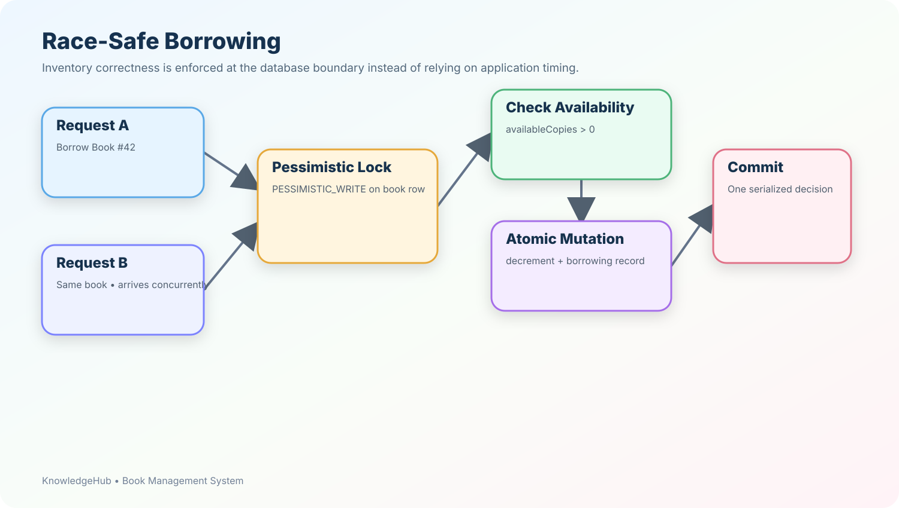

## 2. Optimistic versioning as a secondary guard

The `Book` entity also uses JPA `@Version`.

The design therefore combines:

- **Pessimistic locking** for critical inventory transitions.
- **Optimistic version tracking** for stale entity updates.

The documentation explicitly describes these as complementary controls.

## 3. Return is also a state transition

Returning a book coordinates:

1. Book inventory.
2. Active borrowing state.
3. Return timestamp.
4. Borrowing status.

The relevant rows are locked before the transition is applied.

The protected invariant is:

```text
0 <= availableCopies <= totalCopies
```

and an active borrowing can be returned only once.

---

# 🖼️ Transaction-Aware Book Images

Book images are separated from the relational metadata.

```text
PostgreSQL
──────────
book id
image id
storage key
public URL
content type
file size
display order

Filesystem
──────────
actual image bytes
```

The Library Service documentation describes a transaction-aware lifecycle:

```text
Upload
  │
  ├── validate type / size / decoding
  │
  ├── create UUID filename
  │
  ├── write new file
  │
  ├── persist metadata
  │
  └── transaction outcome
        │
        ├── COMMIT    → cleanup old files
        └── ROLLBACK  → cleanup new files
```

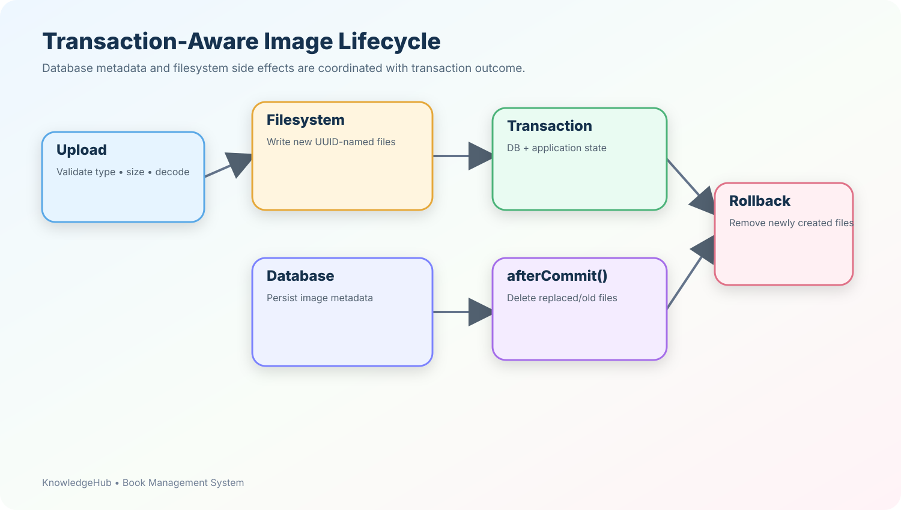

The implementation also validates image content, limits the number of images per book, uses UUID-based filenames, normalizes paths, checks the storage root boundary, and cleans up partially written files after I/O failures.

---

# 🧱 Defense in Depth

The system does not rely on one protection mechanism.

```text
┌────────────────────────────────────┐
│ HTTP / DTO Validation              │
├────────────────────────────────────┤
│ Authentication / RSA JWT           │
├────────────────────────────────────┤
│ Role Authorization                 │
├────────────────────────────────────┤
│ Ownership Checks                   │
├────────────────────────────────────┤
│ Service Business Rules             │
├────────────────────────────────────┤
│ Transaction Boundaries             │
├────────────────────────────────────┤
│ Database Constraints / Locking     │
└────────────────────────────────────┘
```

This gives each layer a specific responsibility:

| Layer | Responsibility |
|---|---|
| DTO | Reject malformed input |
| Security | Establish trusted identity |
| Authorization | Decide whether the action is permitted |
| Service | Enforce business invariants |
| Transaction | Make related writes atomic |
| Database | Protect durable integrity and concurrency |

---

# 👥 Role-Based Experience

The application provides different capabilities depending on the authenticated role.

### 👤 User

The regular user experience centers around:

- Signing in.
- Discovering books.
- Opening book details.
- Reading/using the available reading experience.
- Borrowing available books.
- Returning borrowed books.
- Viewing personal borrowing/reading information.

### 📚 Librarian / Administrator

The management-oriented experience provides broader library operations such as:

- Adding books.
- Updating book information.
- Managing inventory.
- Managing authors and categories.
- Viewing transactions.
- Viewing users.
- Accessing administrative borrowing information.

The exact backend authorization boundary remains authoritative; the UI should never be considered the final security boundary.

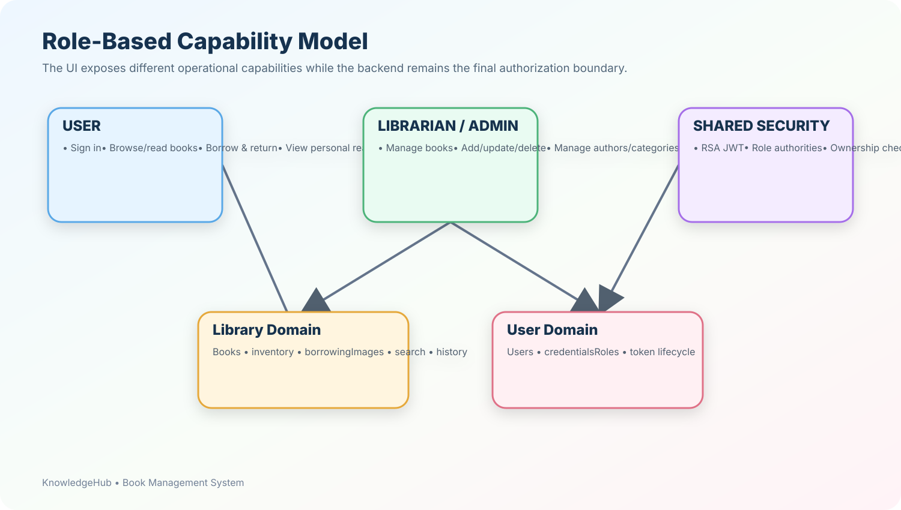

---

# ⚡ Persistence & Performance Strategy

The Library Service documentation describes several deliberate persistence choices:

### Read-oriented transactions

Read services use read-only transaction semantics where appropriate.

### Open Session in View disabled

```properties
spring.jpa.open-in-view=false
```

This keeps database work inside explicit service-layer transactions.

### Optimized relation fetching

The implementation uses:

- `@EntityGraph`
- `JOIN FETCH`
- lazy relations
- `@BatchSize`

to reduce common ORM N+1 patterns.

### Database indexes

The documented access-oriented indexes include fields around:

```text
books.author_id
books.category_id
books.title
books.available_copies
borrowings.book_id
borrowings.borrower_id
borrowings.status
```

### Connection pooling

The supplied configuration defines HikariCP settings including a maximum pool size of 20 and minimum idle size of 5.

---

# 🔄 User-Service Integration

Borrowing records keep the **borrower ID**, while profile ownership remains in the User Service.

When the Library Service needs profile information:

```text
Client
  │
  │ Bearer JWT
  ▼
Library Service
  │
  │ same Bearer JWT
  ▼
User Service
  │
  ▼
User Profile
```

The documented Feign configuration forwards the incoming authorization header rather than creating a second identity.

A small per-response cache also prevents repeated profile requests when multiple borrowing records belong to the same borrower.

---

# 🧹 Token Lifecycle & Logout

The authentication design combines stateless JWT requests with explicit revocation.

```text
LOGIN
  │
  ▼
RSA-signed JWT
  │
  ▼
Normal authenticated requests
  │
  ├── signature validation
  ├── expiration validation
  ├── role extraction
  └── revocation lookup
  │
LOGOUT
  │
  ▼
SHA-256(token)
  │
  ▼
revoked_tokens
  │
  ▼
future token use rejected
  │
  ▼
expiration
  │
  ▼
scheduled cleanup
```

Importantly, the raw JWT is not persisted in the revocation table; the documented approach stores its SHA-256 digest.

---

# 🗄️ Library Domain Model

The documented Library Service domain contains:

```text
AUTHOR ────────< BOOK >──────── CATEGORY
                  │
                  ├────────< BOOK_IMAGE
                  │
                  └────────< BORROWING
```

Core entities:

| Entity | Main responsibility |
|---|---|
| **Author** | Book author information |
| **Category** | Book classification |
| **Book** | Book metadata and inventory |
| **BookImage** | Image metadata |
| **Borrowing** | Borrow/return state |
| **BorrowingStatus** | Borrowing lifecycle state |

A key inventory design is:

```text
borrowedCopies = totalCopies - availableCopies
```

This avoids maintaining three independent counters that could drift apart.

---

# 🔍 Search & Library Operations

The documented search strategy covers user-visible book fields including:

- title
- ISBN
- publisher
- author name
- category name

The comparison is case-insensitive and uses `DISTINCT` with fetched associations to produce complete book responses.

The Library Service also exposes operations for:

```text
Books
Authors
Categories
Book Images
Borrowing
Search
Personal borrowing history
Administrative borrowing history
```

---

# 🧯 Failure Handling

Failures are translated through centralized exception handling instead of being implemented independently in every controller.

Examples documented by the services include:

```text
400 → invalid input / business validation
401 → unauthenticated / invalid token
403 → authenticated but not permitted
404 → resource not found
409 → conflicting state
500 → unexpected failure
```

The Library Service also defines domain-specific failures such as unavailable books, active borrowing conflicts, missing users, and downstream User Service failures.

This keeps the external API contract predictable.

---

# 🧪 High-Value Correctness Scenarios

The most important tests are the ones that challenge the architectural invariants.

| Scenario | Expected result |
|---|---|
| Many users borrow the final copy simultaneously | Exactly one obtains it |
| Same user submits concurrent duplicate borrow requests | At most one active borrowing |
| Same borrowing receives concurrent returns | Inventory increments only once |
| Inventory total is reduced below borrowed count | Operation is rejected |
| Image transaction rolls back after file creation | Newly created file is removed |
| Image replacement commits | Old files are removed after commit |
| Image replacement rolls back | Old files remain; new files are cleaned |
| JWT has wrong audience | Request rejected |
| JWT lacks `userId` | Invalid identity |
| Repeated borrower in one response | Profile retrieved once per distinct borrower |

---

# 🎨 Application Experience

The following screenshots are placed in the requested product-flow order.

## 1. 🔑 Sign In

The application begins with a dedicated authentication experience where users provide their credentials before entering the protected application.

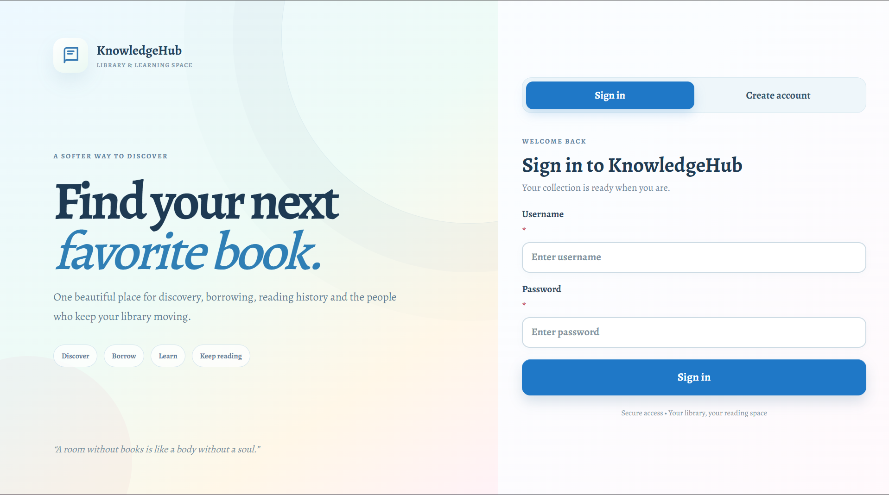

---

## 2. 🏠 Home

The home dashboard provides the primary entry point into the KnowledgeHub experience, with navigation and library-focused summary information.

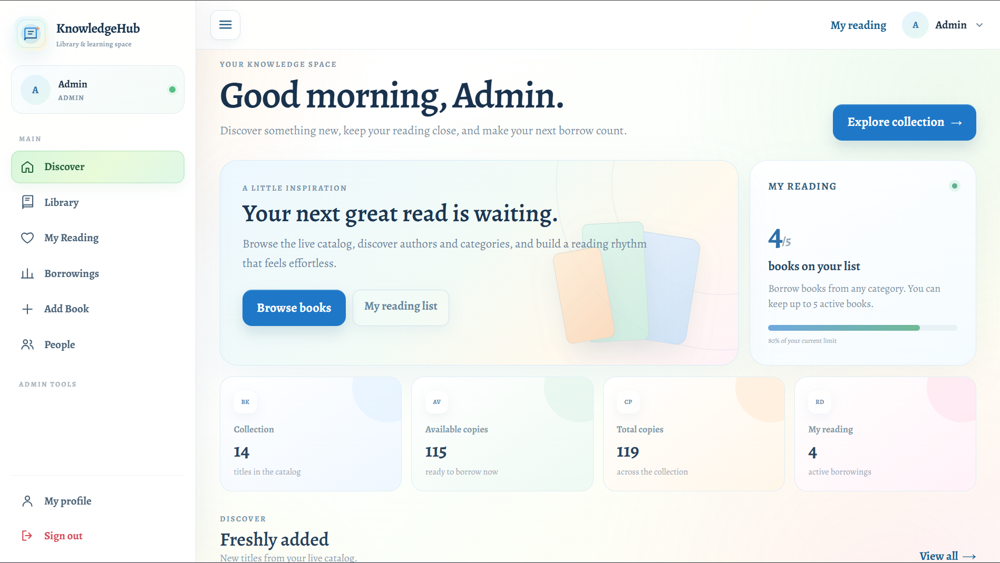

---

## 3. 📚 Library

The Library view provides book discovery and actions around the available collection.

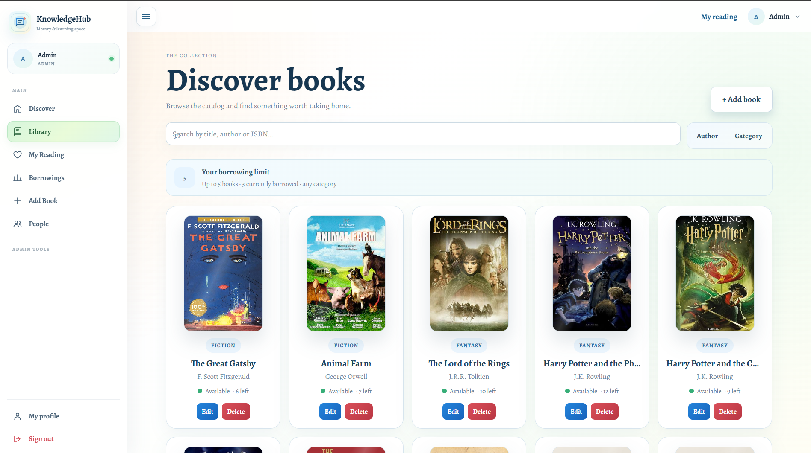

---

## 4. 📖 Book Details

The book-details view brings together the selected book's information, availability and borrowing-oriented actions.

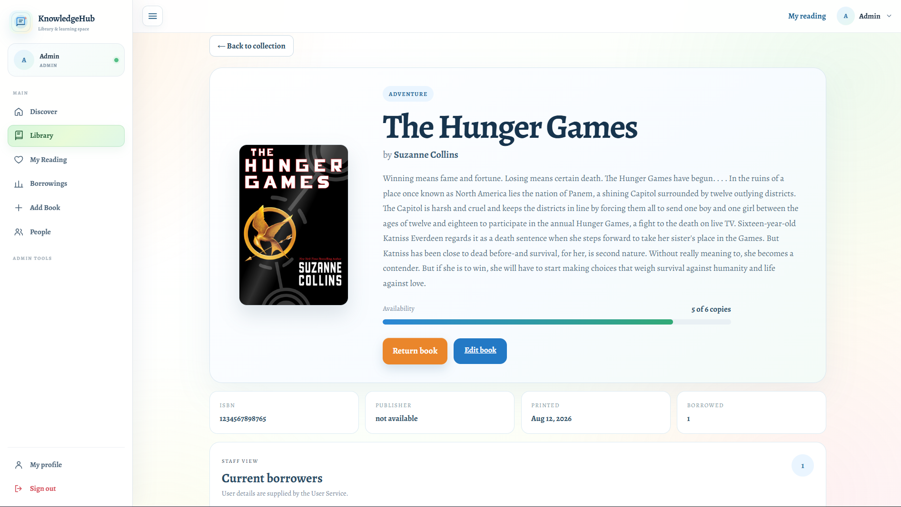

---

## 5. 📕 Readings

The readings area provides the user's reading/borrowing-oriented view and associated actions.

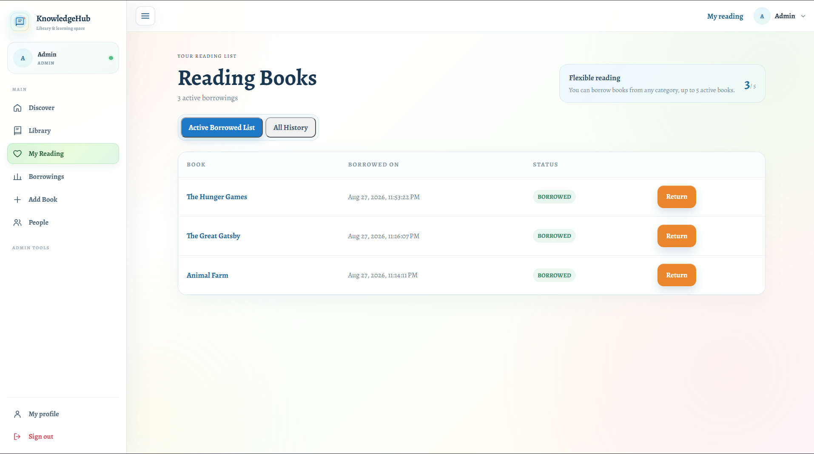

---

## 6. ➕ New Book

The management workflow includes a dedicated form for adding a new book, including core book information and image handling.

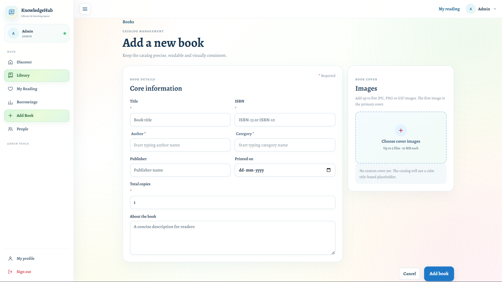

---

## 7. 🔄 Transactions

The transactions workspace exposes borrowing activity and administrative transaction information.

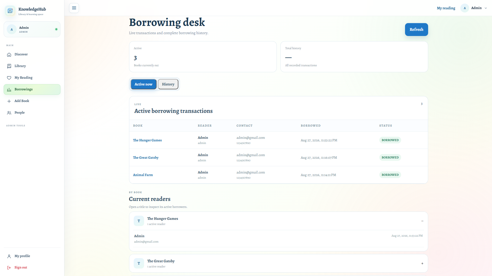

---

## 8. 👥 Users

The users workspace provides the management-facing interface for people/user administration.

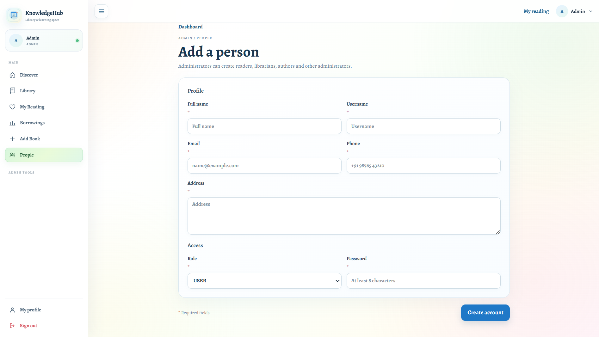

---

## 9. 🧑‍🎓 Profile

The Profile.

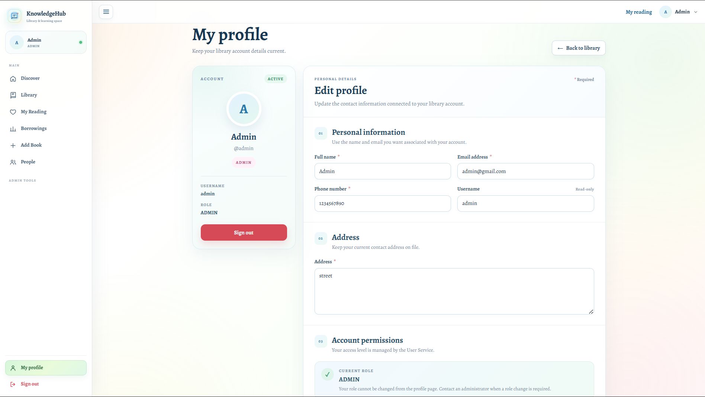

---

# 🧭 End-to-End User Journey

```text
                 ┌───────────────┐
                 │    Sign In    │
                 └───────┬───────┘
                         │
                         ▼
                 ┌───────────────┐
                 │     Home      │
                 └───────┬───────┘
                         │
              ┌──────────┼───────────┐
              ▼          ▼           ▼
          Library      Readings   Management
              │          │        ┌──┴───────────────┐
              ▼          ▼        ▼      ▼      ▼     ▼
            Book      History   New Book Users Transactions
              │
              ▼
        Borrow / Return
              │
              ▼
     Library Service Transaction
              │
              ▼
        PostgreSQL State
```

---

# 🌟 Engineering Principles

The overall implementation can be summarized by six principles:

| Principle | Implementation |
|---|---|
| 🔐 **Trusted Identity** | RSA/RS256 JWT with validated identity claims |
| 🛡️ **Explicit Authorization** | Roles + authenticated-user ownership |
| 🚦 **Concurrency Safety** | Database pessimistic locking + optimistic versioning |
| 🔄 **Atomic State Changes** | Explicit service transactions |
| 🧱 **Durable Integrity** | Validation + database constraints |
| 🌐 **Service Separation** | User identity isolated from library business state |

The important idea is that correctness is enforced **across boundaries**, not inside a single controller.

---

# 💎 What Makes the Project Different?

### 1. It is more than CRUD

The design explicitly addresses:

- concurrent borrowing,
- inventory consistency,
- identity spoofing,
- token invalidation,
- inter-service authentication propagation,
- filesystem/database consistency,
- ORM query behavior,
- transactional failure.

### 2. The database participates in correctness

The database is not merely a persistence destination.

It also provides:

- row-level locking,
- uniqueness constraints,
- transactional atomicity,
- durable inventory state.

### 3. Identity and domain ownership are separated

The User Service owns identity.

The Library Service owns library state.

That makes the service boundaries easier to reason about and evolve.

### 4. Stateless security with controlled logout

JWT keeps normal requests sessionless, while a bounded revocation mechanism gives logout explicit semantics.

### 5. Side effects are transaction-aware

Filesystem changes are coordinated with database transaction outcomes instead of assuming that a database commit will always succeed.

---

# 📈 Natural Evolution Path

The supplied service documentation identifies several future extensions:

- distributed JWKS / key discovery
- RSA key rotation
- Redis-backed revocation
- refresh-token rotation
- authentication rate limiting
- security audit events
- observability and metrics
- stronger concurrent integration testing
- database migration tooling
- containerized deployment
- health/readiness probes
- object storage such as S3/MinIO/Azure Blob behind the existing image-storage abstraction
- caching for user profile enrichment
- pagination for large datasets
- resilience policies around User Service calls

These are **evolution paths**, not prerequisites for the current architectural foundation.

---

# 🏁 Final Architecture Perspective

KnowledgeHub is built around a simple chain:

```text
                 TRUSTED IDENTITY
                        │
                        ▼
                   RSA JWT
                        │
                        ▼
             AUTHENTICATION + ROLE
                        │
                        ▼
             BUSINESS AUTHORIZATION
                        │
                        ▼
              TRANSACTION BOUNDARY
                        │
                        ▼
            DATABASE / FILE INTEGRITY
```

The project therefore aims for more than:

> **“The endpoints work.”**

It aims for:

> **“The system remains trustworthy when users compete for the same inventory, credentials are invalidated, authorization is challenged, and operations fail partway through.”**

### 🔐 Identity you can verify  
### 🛡️ Access you can control  
### 🚦 State you can protect  
### 🧱 Data you can trust  
### 🌐 Services you can evolve

---

## 📚 Source Documentation

The detailed User Service and Library Service engineering documents supplied with the project were used as the implementation basis for this README.

