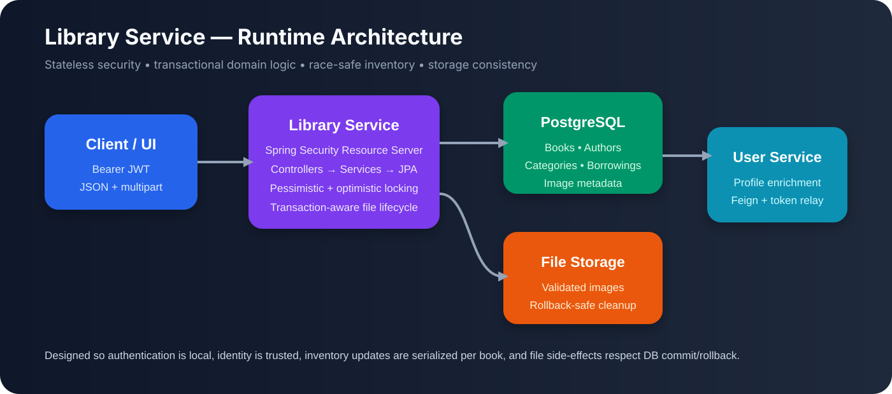
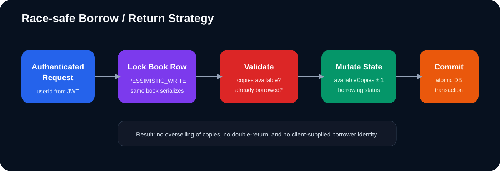
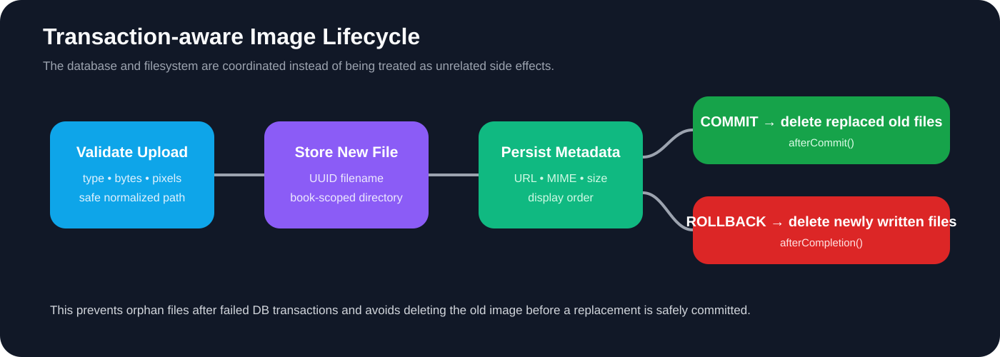
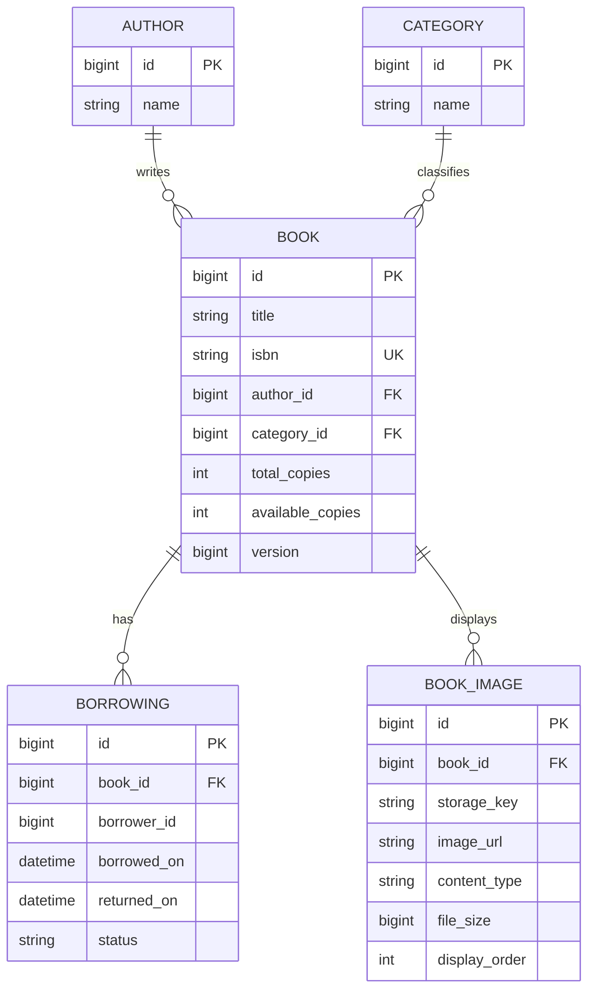

<div align="center">

# 📚 BMS Library Service

### A concurrency-safe, security-first library microservice built for correctness under real multi-user traffic

**Spring Boot · PostgreSQL · Spring Security · RSA JWT · OpenFeign · JPA/Hibernate · Transaction-Aware File Storage**

<br/>



<br/>

> **Not just CRUD.** The service is designed around the hard parts of a real library system: trusted user identity, simultaneous borrowing, inventory consistency, distributed user-profile enrichment, safe image storage, and clean transactional boundaries.

</div>

---

## 🌟 Why This Implementation Stands Out

A basic library backend can create books and record borrow operations. This implementation goes further by treating **concurrency, identity, database consistency, inter-service communication, and filesystem side effects as first-class engineering problems**.

| Engineering concern | Our implementation strategy | Why it matters |
|---|---|---|
| 🔐 Authentication | Local RSA JWT verification using Spring Security Resource Server | No authentication network call is required for every request |
| 🪪 Trusted borrower identity | `userId` is extracted from the authenticated JWT | Clients cannot borrow/return books by submitting another user's ID |
| 🚦 Concurrent borrowing | `PESSIMISTIC_WRITE` lock on the target book row | Two simultaneous requests cannot consume the same last copy |
| 🛡️ Secondary consistency guard | JPA `@Version` optimistic versioning on `Book` | Adds protection against conflicting entity updates |
| ↩️ Safe return flow | Locks the book and the active borrowing record | Prevents duplicate returns and inventory over-increment |
| 🖼️ Image consistency | Filesystem operations coordinated with DB transaction callbacks | Avoids orphan files and unsafe early deletion |
| 🧠 Efficient user enrichment | Request-scoped in-memory borrower cache | Repeated borrowing rows for one user trigger only one profile lookup per response |
| ⚡ Efficient ORM fetching | `@EntityGraph`, `JOIN FETCH`, lazy relations, `@BatchSize` | Reduces common N+1 query patterns |
| 🌐 Microservice propagation | OpenFeign forwards the incoming Bearer token | Downstream User Service calls preserve caller security context |
| 🧱 Production-oriented DB boundaries | `open-in-view=false`, explicit transactions, HikariCP settings | Keeps persistence work inside the service layer instead of leaking into controllers |

---

# 🧠 Core Design Philosophy

The service follows one central principle:

> **A successful API response should represent a state that is valid in the database, valid in the filesystem, and attributable to the authenticated user—even when multiple requests execute at the same time.**

That principle drives the implementation of borrowing, returning, image replacement, JWT validation, and user-service integration.

---

# 🏗️ Architecture

The application is organized as a layered Spring Boot microservice:

```text
HTTP Request
    │
    ▼
Spring Security Resource Server
    │  verifies RSA-signed JWT
    │  validates issuer + audience + required claims
    ▼
Controllers
    │
    ▼
Service Layer  ← transaction boundary + business rules
    │
    ├──────────────► OpenFeign ─────────────► User Service
    │                 Bearer token relay       user profile enrichment
    │
    ├──────────────► Spring Data JPA ────────► PostgreSQL
    │                 locks + fetch plans       source of business state
    │
    └──────────────► Image Storage Service ──► Filesystem
                      validation + lifecycle     binary image data
```

### Architectural separation

- **Controllers** expose HTTP contracts and obtain authenticated identity.
- **Services** own transactions and business invariants.
- **Repositories** express locking and optimized database access patterns.
- **Entities** protect important domain state such as copy availability.
- **Security components** verify identity independently of controller logic.
- **Feign integration** enriches local borrowing records with remote user data.
- **Image storage abstraction** keeps binary storage separate from JPA metadata.
- **Global exception handling** converts domain failures into controlled HTTP responses.

---

# 🚀 Signature Approach #1 — Race-Safe Borrowing



Borrowing is deliberately implemented as a **serialized state transition for one book**, not as a naïve read-check-write sequence.

### The problem with ordinary CRUD

Imagine a book has exactly one available copy:

```text
availableCopies = 1
```

Two requests arrive almost simultaneously. Without locking, both transactions could read `1`, both decide the book is available, and both create a borrowing record. The system would have loaned one physical copy twice.

### Our strategy

`BookRepository.findByIdForUpdate(...)` uses:

```java
@Lock(LockModeType.PESSIMISTIC_WRITE)
```

The borrow transaction then performs the following while owning the book-row lock:

1. Load and lock the target book.
2. Confirm `availableCopies > 0`.
3. Confirm this borrower does not already have an active borrowing for the book.
4. Decrement availability through the domain method `book.borrowCopy()`.
5. Create the `Borrowing` record.
6. Commit both changes atomically.

A competing borrow request for the **same book** must wait for the first transaction to finish before it can evaluate availability.

### Why this design is significant

The database becomes the concurrency coordinator. Correctness does not depend on Java `synchronized`, a single application instance, or timing assumptions. The strategy therefore remains meaningful when the service is horizontally scaled and multiple application instances access the same PostgreSQL database.

---

# ↩️ Signature Approach #2 — Safe Return Processing

Returning a book is also treated as a concurrent state transition.

The implementation:

- locks the `Book` row with `PESSIMISTIC_WRITE`,
- locks the borrower's active `Borrowing` row,
- changes borrowing status to returned,
- records the return timestamp,
- increments `availableCopies`,
- completes everything inside one transaction.

This protects two invariants:

```text
0 <= availableCopies <= totalCopies
```

and

```text
one active borrowing can be returned only once
```

The `Book.returnCopy()` domain method additionally refuses to increase availability when every copy is already available.

---

# 🧬 Signature Approach #3 — Two Layers of Concurrency Protection

The `Book` entity also contains:

```java
@Version
private Long version;
```

This provides **optimistic version tracking** in addition to explicit pessimistic locking on critical write paths.

The two mechanisms solve related but different problems:

- **Pessimistic locking** is intentionally used where contention changes business correctness—especially borrow, return, update, and delete operations on inventory.
- **Optimistic versioning** provides a general stale-update safeguard for versioned entity state.

This combination makes concurrency handling explicit instead of accidental.

---

# 🔐 Signature Approach #4 — Stateless RSA JWT Security

Authentication is performed locally by Spring Security's OAuth2 Resource Server support.

The service loads an RSA public key and configures a `NimbusJwtDecoder`. A token must satisfy all of the following before it is accepted:

```text
✓ Valid RSA signature
✓ Valid standard JWT timing constraints
✓ Expected issuer
✓ Expected audience
✓ Positive userId claim
✓ Non-empty subject
✓ Non-empty role
```

Default identity expectations are:

```properties
jwt.issuer=bms-user-service
jwt.audience=bms-library-service
```

### Why local verification is better than remote validation per request

Although the Feign interface contains a token-validation endpoint contract, the actual Spring Security request pipeline validates JWTs **inside this service** using the public key.

That gives the request path an important property:

```text
Client → Library Service → local cryptographic verification
```

instead of:

```text
Client → Library Service → User Service → validate token → continue request
```

This reduces authentication latency, removes a synchronous dependency from every protected request, and lets the Library Service remain stateless.

---

# 🪪 Signature Approach #5 — Borrower Identity Cannot Be Spoofed by Request Data

Borrow and return endpoints do not trust a `borrowerId` sent in the body or query string.

Instead:

```java
Long borrowerId = CurrentUser.getUserId(authentication);
```

The identity comes from the already verified JWT claim.

This is an important authorization design choice. The API expresses operations as:

```text
POST /books/{bookId}/borrow
POST /books/{bookId}/return
```

rather than letting a caller choose an arbitrary borrower identifier.

The same approach is used for personal history endpoints:

```text
GET /borrow/me
GET /borrow/me/books
```

The server decides who **“me”** is.

---

# 🔄 Signature Approach #6 — Secure User-Service Enrichment

Borrowing records store `borrowerId`, while profile information belongs to the User Service. That keeps the Library Service from duplicating user ownership data.

When enriched borrowing responses are required, OpenFeign fetches the current user profile.

### Security context propagation

`UserFeignConfiguration` reads the incoming HTTP `Authorization` header and forwards the Bearer token to the downstream request.

```text
Browser / Client
      │ Bearer JWT
      ▼
Library Service
      │ same Bearer JWT
      ▼
User Service
```

The Library Service therefore does not manufacture a second identity for the downstream call.

### Per-response profile cache

Borrowing history may contain many records for the same person. Calling the User Service once for every row would produce needless network traffic.

The service creates a local `Map<Long, UserResponse>` and uses:

```java
computeIfAbsent(borrowerId, this::getUserDetails)
```

So, within one generated response, each distinct borrower profile is fetched at most once.

This is a small but meaningful optimization that addresses an **inter-service N+1 problem**, not only a database N+1 problem.

### Explicit downstream failure mapping

Feign failures are translated into domain-specific exceptions for:

- missing user profiles,
- unauthorized propagated authentication,
- forbidden access,
- other User Service HTTP failures,
- general downstream unavailability.

This makes remote-service failure behavior deliberate instead of leaking raw Feign exceptions through the API.

---

# 🖼️ Signature Approach #7 — Transaction-Aware Image Storage



Book images are not stored as large database BLOBs. The design separates:

```text
PostgreSQL                    Filesystem
──────────                    ──────────
image id                      actual image bytes
book id                       book-scoped directory
public URL                    UUID filename
content type
original filename
file size
display order
storage key
```

The most interesting part is not this separation itself—it is **how database transactions are coordinated with filesystem side effects**.

### On replacement

New files are written first. New metadata is persisted. Old metadata is removed. Then transaction synchronization decides which files are safe to delete.

### If the transaction commits

`afterCommit()` removes replaced/deleted old files.

### If the transaction rolls back

`afterCompletion(...)` removes the newly created files.

This avoids two classic filesystem/database inconsistency cases:

```text
DB rollback + new file remains     → orphan file
DB failure + old file deleted      → broken metadata / missing image
```

The service avoids both by delaying irreversible cleanup until transaction outcome is known.

---

# 🛡️ Defensive Image Validation

Uploads are validated before they become persistent application data.

The filesystem implementation enforces:

- JPEG, PNG, or GIF content types only,
- configurable maximum byte size,
- actual image decoding through `ImageIO`,
- a maximum of **25,000,000 pixels** per image,
- a maximum of **5 images per book**,
- generated UUID filenames instead of trusting client filenames,
- normalized paths with root-directory boundary checks,
- cleanup of partially copied files after I/O failure.

These checks address malformed uploads, oversized images, filename collisions, and path traversal risks.

---

# ⚡ Persistence & Query Optimization Strategy

The implementation contains several choices intended to keep ORM behavior predictable.

### 1. Open Session in View is disabled

```properties
spring.jpa.open-in-view=false
```

Database access therefore belongs inside explicit service transactions instead of happening unexpectedly during response serialization.

### 2. Read operations use read-only transactions

Query services are annotated with:

```java
@Transactional(readOnly = true)
```

This documents intent and keeps transaction boundaries consistent.

### 3. Author and category data are eagerly fetched only where needed

`BookRepository.findAll()` uses:

```java
@EntityGraph(attributePaths = {"author", "category"})
```

and several targeted queries use `JOIN FETCH`.

This avoids repeatedly loading author/category relations one row at a time while still keeping entity mappings themselves lazy.

### 4. Collection fetching is batch-aware

The `Book` entity applies:

```java
@BatchSize(size = 50)
```

to borrowing and image collections, reducing repetitive lazy collection queries when Hibernate needs to initialize several books' collections.

### 5. Database indexes reflect access patterns

The entities define indexes around commonly queried fields, including:

```text
books.author_id
books.category_id
books.title
books.available_copies
borrowings.book_id
borrowings.borrower_id
borrowings.status
```

ISBN is protected by a database-level unique constraint as the final authority for uniqueness.

### 6. Connection pooling is explicitly configured

The supplied configuration defines a HikariCP pool with a maximum size of 20 and minimum idle size of 5, rather than relying entirely on implicit defaults.

---

# 📖 Domain Model



### Important inventory invariant

Borrowed copies are derived instead of independently persisted:

```java
borrowedCopies = totalCopies - availableCopies;
```

This avoids maintaining three independent counters that could drift apart.

When total inventory is updated, the service first determines how many copies are currently borrowed and rejects any new total smaller than that number.

---

# 🧩 Project Structure

```text
src/main/java/com/bms/library/
│
├── LibraryServiceApplication.java
│
├── controller/
│   ├── AuthorController.java
│   ├── BooksController.java
│   ├── BorrowersController.java
│   └── CategoryController.java
│
├── dto/
│   ├── AuthorRequest.java
│   ├── AuthorResponse.java
│   ├── BookRequest.java
│   ├── BookResponse.java
│   ├── BookImageResponse.java
│   ├── BorrowingResponse.java
│   └── ...
│
├── entity/
│   ├── Author.java
│   ├── Book.java
│   ├── BookImage.java
│   ├── Borrowing.java
│   ├── BorrowingStatus.java
│   └── Category.java
│
├── exception/
│   ├── GlobalExceptionHandler.java
│   └── domain-specific exceptions...
│
├── feign/
│   ├── UserInterface.java
│   └── UserFeignConfiguration.java
│
├── image/
│   ├── BookImageStorageService.java
│   └── FileSystemBookImageStorageService.java
│
├── repository/
│   ├── AuthorRepository.java
│   ├── BookRepository.java
│   ├── BookImageRepository.java
│   ├── BorrowingRepository.java
│   └── CategoryRepository.java
│
├── security/
│   ├── CorsConfig.java
│   ├── CurrentUser.java
│   ├── RsaKeyConfig.java
│   └── SecurityConfig.java
│
└── service/
    ├── AuthorService.java / AuthorServiceImpl.java
    ├── BookService.java / BookServiceImpl.java
    ├── BookImageService.java / BookImageServiceImpl.java
    ├── BorrowingService.java / BorrowingServiceImpl.java
    └── CategoryService.java / CategoryServiceImpl.java
```

---

# 🔌 API Overview

All application endpoints are authenticated unless explicitly permitted by the security configuration.

## Books

| Method | Endpoint | Purpose |
|---|---|---|
| `POST` | `/books` | Create a book from JSON |
| `POST` | `/books` with multipart | Create a book with optional images |
| `POST` | `/books/with-images` | Explicit multipart create endpoint |
| `GET` | `/books` | List books |
| `GET` | `/books/{id}` | Get book details and whether the authenticated user currently borrowed it |
| `GET` | `/books/search?keyword=...` | Search by title, ISBN, publisher, author, or category |
| `GET` | `/books/author/{authorId}` | Find books by author |
| `GET` | `/books/category/{categoryId}` | Find books by category |
| `PUT` | `/books/{id}` | Update book metadata/inventory |
| `PUT` | `/books/{id}` with multipart | Update book and optionally replace images |
| `DELETE` | `/books/{id}` | Delete a book if no active borrowing exists |
| `POST` | `/books/{id}/borrow` | Borrow as the authenticated user |
| `POST` | `/books/{id}/return` | Return as the authenticated user |

## Book Images

| Method | Endpoint | Purpose |
|---|---|---|
| `POST` | `/books/{id}/images` | Add images |
| `PUT` | `/books/{id}/images` | Replace the image set |
| `GET` | `/books/{id}/images` | List image metadata |
| `GET` | `/books/{id}/images/{imageId}` | Stream image bytes |
| `DELETE` | `/books/{id}/images/{imageId}` | Delete one image and re-sequence display order |

## Authors

| Method | Endpoint | Purpose |
|---|---|---|
| `POST` | `/authors` | Create author |
| `GET` | `/authors` | List authors |
| `GET` | `/authors/{id}` | Get author |
| `GET` | `/authors/search?keyword=...` | Search authors |
| `PUT` | `/authors/{id}` | Update author |
| `DELETE` | `/authors/{id}` | Delete author |

## Categories

| Method | Endpoint | Purpose |
|---|---|---|
| `POST` | `/categories` | Create category |
| `GET` | `/categories` | List categories |
| `GET` | `/categories/{id}` | Get category |
| `GET` | `/categories/search?keyword=...` | Search categories |
| `PUT` | `/categories/{id}` | Update category |
| `DELETE` | `/categories/{id}` | Delete category |

## Borrowing Views

| Method | Endpoint | Access enforced in code | Purpose |
|---|---|---|---|
| `GET` | `/borrow/me` | Authenticated user | My complete borrowing history |
| `GET` | `/borrow/me/books` | Authenticated user | My active borrowings |
| `GET` | `/borrow/books/{bookId}` | Admin role | Active borrowers for a book |
| `GET` | `/borrow/books/{bookId}/history` | Admin role | Full history for a book |
| `GET` | `/borrow/active?sort=asc\|desc` | Admin role | All active borrowings |
| `GET` | `/borrow/history` | Admin role | Global borrowing history |

> **Authorization note:** in the reviewed source, admin enforcement is explicit on administrative borrowing-report endpoints. Other CRUD routes require authentication at the global security layer but do not currently call `requireAdmin()` themselves.

---

# 🔍 Search Strategy

Book search is implemented as a single repository query across multiple user-visible fields:

```text
title
ISBN
publisher
author name
category name
```

The comparison is case-insensitive and uses `DISTINCT` with fetched author/category associations to return complete book response data without follow-up relation queries.

---

# 🗑️ Safe Delete Rules

Deleting a book is more than `repository.deleteById(...)`.

The implementation:

1. Locks the book row.
2. Verifies that no active borrowing exists.
3. Refuses deletion if any copy is currently borrowed.
4. Schedules image metadata/file cleanup.
5. Deletes the book inside the same database transaction.
6. Removes physical image files only after a successful commit.

This avoids deleting inventory that is still part of an active loan and prevents filesystem cleanup from getting ahead of the database transaction.

---

# ✅ Validation & Data Integrity

Request DTOs use Jakarta Bean Validation to reject invalid input before it reaches core business logic.

Examples include:

```text
Book title              required, max 250 chars
ISBN                    required, max 20 chars
Author/category IDs     positive
Publisher               max 200 chars
Printed date            cannot be in the future
Total copies            minimum 1
Description/about       max 5000 chars
Author name             required, max 150 chars
Category name           required, max 100 chars
```

Business validation then adds rules that Bean Validation cannot express alone—for example, preventing total copies from being reduced below the number already borrowed.

---

# 🧯 Error Handling

The project defines domain-specific exceptions such as:

```text
BookNotFoundException
BookUnavailableException
ActiveBorrowingExistsException
BorrowingNotFoundException
AuthorNotFoundException
CategoryNotFoundException
UserProfileNotFoundException
UserServiceUnavailableException
```

`GlobalExceptionHandler` centralizes translation of these failures into controlled HTTP responses, keeping controllers focused on request/response orchestration.

---

# ⚙️ Configuration

The reviewed `application.properties` uses PostgreSQL and externalizable security settings.

```properties
spring.application.name=library-service

spring.datasource.url=jdbc:postgresql://localhost:5432/Library_DB
spring.datasource.username=postgres
spring.datasource.password=5432

spring.jpa.hibernate.ddl-auto=validate
spring.jpa.open-in-view=false
spring.jpa.properties.hibernate.jdbc.time_zone=UTC

spring.flyway.enabled=true
spring.flyway.locations=classpath:db/migration

spring.datasource.hikari.maximum-pool-size=20
spring.datasource.hikari.minimum-idle=5
spring.datasource.hikari.connection-timeout=30000
spring.datasource.hikari.idle-timeout=600000
spring.datasource.hikari.max-lifetime=1800000

jwt.public-key=${JWT_PUBLIC_KEY:classpath:keys/public-key.pem}
jwt.issuer=${JWT_ISSUER:bms-user-service}
jwt.audience=${JWT_AUDIENCE:bms-library-service}
security.cors.allowed-origins=${CORS_ALLOWED_ORIGINS:http://localhost:4200}
```

### Recommended environment overrides

For deployed environments, keep credentials and environment-specific addresses outside source control, for example:

```bash
export JWT_PUBLIC_KEY="file:/run/secrets/library-public-key.pem"
export JWT_ISSUER="bms-user-service"
export JWT_AUDIENCE="bms-library-service"
export CORS_ALLOWED_ORIGINS="https://your-frontend.example.com"
```

Also externalize database credentials in the deployment environment rather than committing production passwords.

---

# 🗄️ Database Migration Strategy

Hibernate is configured with:

```properties
spring.jpa.hibernate.ddl-auto=validate
```

and Flyway is enabled.

That is a strong production-oriented combination:

```text
Flyway owns schema evolution
        +
Hibernate validates entity ↔ schema compatibility
        =
No accidental runtime schema mutation
```

For a complete build, versioned migration scripts should live under:

```text
src/main/resources/db/migration/
```

---

# ▶️ Running the Service

### Prerequisites

- Java 17+ compatible Spring Boot environment
- PostgreSQL
- A User Service capable of issuing compatible RSA-signed JWTs
- The matching RSA public key for token verification
- The project's build descriptor and dependencies
- Flyway migration scripts matching the entity model

### Database

Create the configured database or provide your own datasource configuration:

```sql
CREATE DATABASE "Library_DB";
```

### Start the User Service

The Feign client defaults to:

```text
http://localhost:8081
```

Override `user-service.url` in your complete application configuration when needed.

### Start the Library Service

For a Maven-based parent project:

```bash
./mvnw spring-boot:run
```

or:

```bash
mvn spring-boot:run
```

> The reviewed upload contains the `src` tree only, so the exact build command and dependency versions are determined by the build file in the complete repository.

---

# 🔑 JWT Contract

A valid Library Service token is expected to contain identity information equivalent to:

```json
{
  "sub": "username",
  "userId": 42,
  "role": "USER",
  "iss": "issuer",
  "aud": ["xxxxxxxxxx"]
}
```

The RSA signature is verified using the configured public key.

Admin borrowing-report endpoints accept roles matching `ADMIN` or `ROLE_ADMIN` through `CurrentUser.requireAdmin(...)`.

---

# 🧪 High-Value Test Scenarios

The most valuable tests for this service are not only simple CRUD tests. They should stress the behaviors that make the architecture unique.

| Scenario | Expected invariant |
|---|---|
| 20 users attempt to borrow the final copy simultaneously | Exactly one request obtains the copy |
| Same user sends duplicate concurrent borrow requests | At most one active borrowing exists |
| Same active borrowing receives concurrent return requests | Availability increments only once |
| Admin reduces total inventory while copies are borrowed | New total cannot fall below borrowed count |
| Image metadata transaction fails after file creation | Newly created file is removed |
| Replacing images succeeds | Old files are removed only after commit |
| Replacing images rolls back | Old files remain; new files are cleaned up |
| JWT has wrong audience | Request is rejected before controller execution |
| JWT lacks `userId` | Request is rejected as invalid identity |
| Borrowing report has repeated rows for one borrower | User profile is retrieved once per distinct user in that response |

---

# 📊 Engineering Trade-offs

Good architecture is not about pretending every decision has zero cost.

### Pessimistic locking

**Strength:** deterministic correctness for contested inventory.

**Trade-off:** concurrent operations on the same book become serialized. This is intentional—the business resource itself is limited. Operations on different book rows can still proceed independently.

### Filesystem image storage

**Strength:** simple, fast local storage with database metadata kept small.

**Trade-off:** in a multi-instance deployment, local disks require shared storage, mounted volumes, or a future object-storage implementation. The `BookImageStorageService` abstraction makes that replacement feasible without redesigning controllers or book-domain logic.

### Synchronous User Service enrichment

**Strength:** borrowing responses contain current user profile information without duplicating user data locally.

**Trade-off:** enriched history endpoints depend on User Service availability. The per-response cache reduces duplicate calls, and domain-specific failure translation keeps the failure mode controlled.

---

# 🔮 Natural Evolution Path

The current design already creates useful extension points. A production evolution could add:

- S3/MinIO/Azure Blob implementation behind `BookImageStorageService`,
- Redis/Caffeine cache for user profile enrichment,
- pagination for large book and borrowing-history datasets,
- database-level uniqueness for one active `(book, borrower)` borrowing where supported by the schema strategy,
- `@PreAuthorize`/request-matcher policies for finer-grained CRUD authorization,
- observability with Actuator + Micrometer metrics,
- resilience policies such as timeouts/circuit breaking around User Service calls,
- integration tests using PostgreSQL Testcontainers,
- concurrent borrow/return stress tests.

These are extensions of the existing architecture—not replacements for it.

---

# 🏆 What Makes This Service Different

<div align="center">

| 🔒 Security-first | 🚦 Concurrency-safe | 🖼️ Transaction-aware | ⚡ Query-conscious | 🌐 Microservice-ready |
|---|---|---|---|---|
| Local RSA JWT validation | Row-level locks | Commit/rollback file lifecycle | Entity graphs & fetch joins | Feign token propagation |
| Trusted JWT identity | Duplicate-borrow protection | Safe replacement cleanup | Batch collection loading | User profile enrichment |
| Issuer/audience checks | Safe inventory mutation | Upload hardening | Read-only transactions | Per-response user cache |

</div>

The key differentiator is that **correctness is designed across boundaries**:

```text
Security boundary      → Who is performing the action?
Transaction boundary   → Which state changes succeed together?
Concurrency boundary   → What happens when requests race?
Service boundary       → How is user identity propagated downstream?
Storage boundary       → What happens to files when the DB rolls back?
Persistence boundary   → How are relations loaded without accidental query explosions?
```

That is the difference between a collection of CRUD endpoints and an engineered service.

---

<div align="center">

### Built around trustworthy identity, consistent inventory, and failure-safe state transitions.

**BMS Library Service** · Spring Boot microservice architecture

</div>

---

