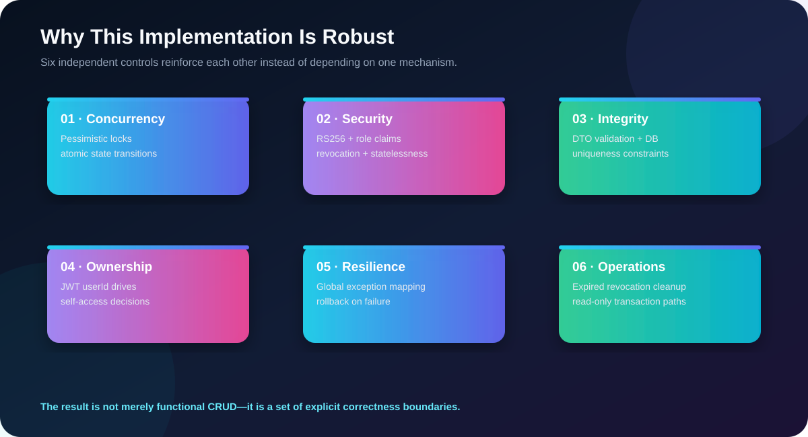
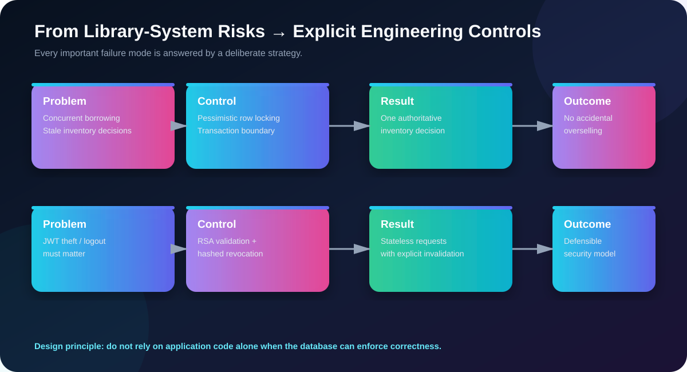
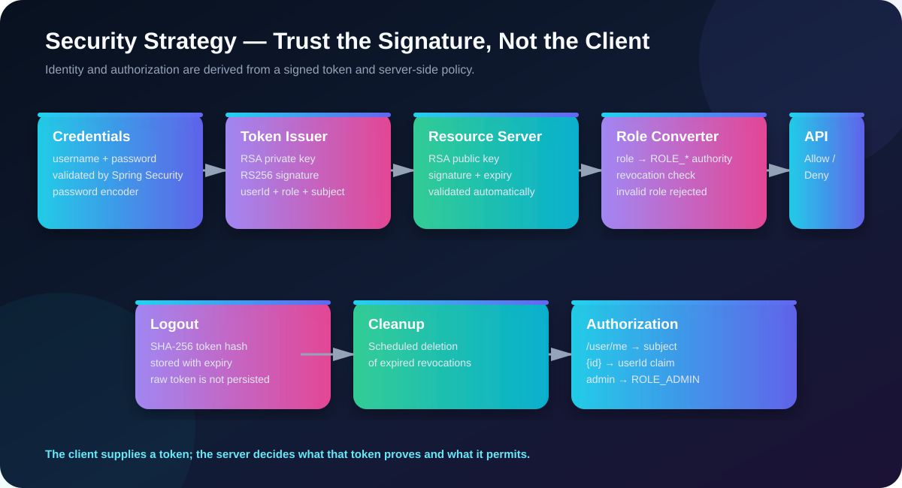
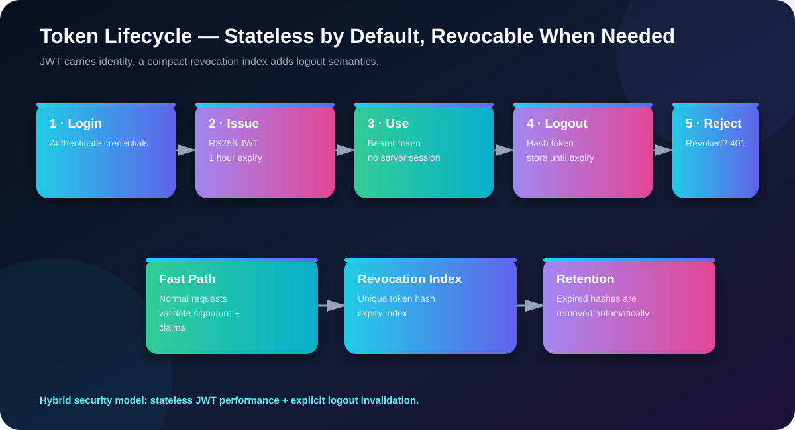
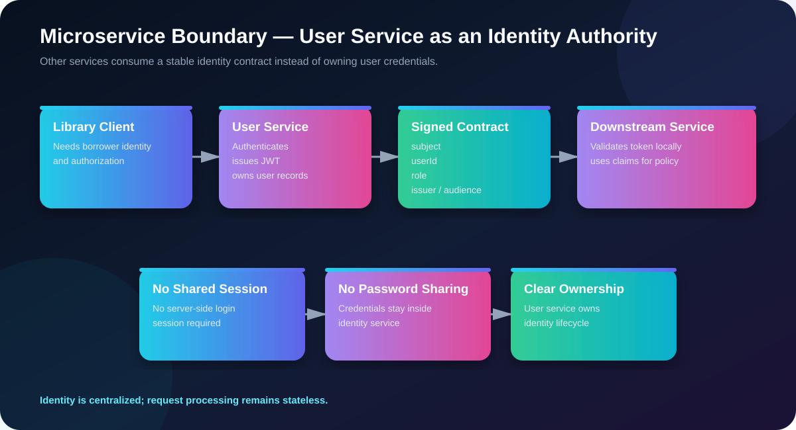
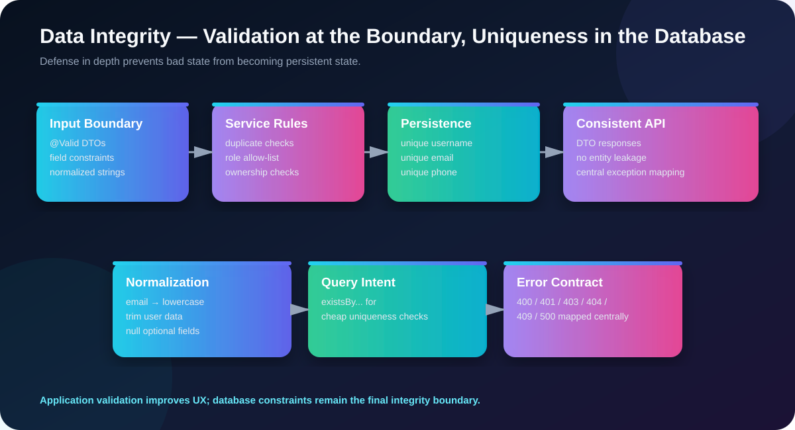
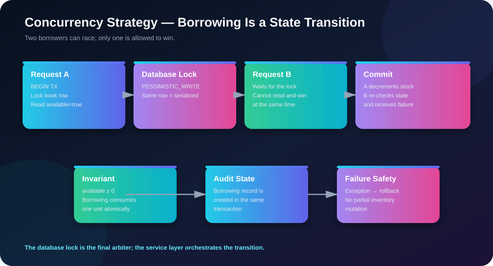
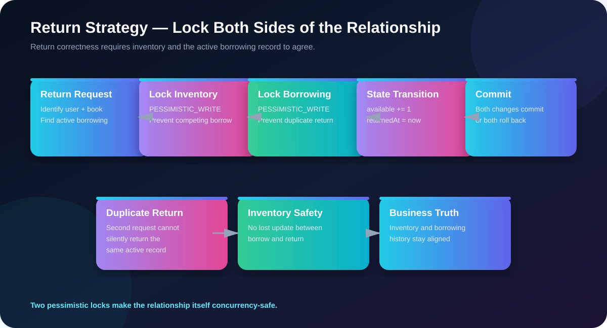

# 🔐 BMS User Service
### **An Identity Service Designed Around Trust, Correctness & Controlled State Transitions**

<p align="center">
  
</p>

> **The objective is not simply to store users and issue JWTs.**
>
> The objective is to make identity, authorization, concurrency, logout, data integrity, and service boundaries behave predictably—even when requests are concurrent, tokens are revoked, or operations fail halfway through.

---

## 🎯 The Core Problem We Solve

A library-management platform needs a trustworthy identity authority.

At first glance, that sounds simple:

**register → login → JWT → authenticated API**

But a production-oriented implementation has several harder questions:

- How do we know the client is really who the token says it is?
- How do we prevent a user from reading or modifying another user's profile?
- How does logout work if authentication is stateless?
- How can another service trust the identity without sharing a session or a password database?
- How do we prevent duplicate usernames, emails, and phone numbers?
- What happens when two requests try to modify the same business state concurrently?
- What happens when a database operation fails after some application work has already happened?
- How do we make failure responses consistent instead of leaking internal implementation details?

This service answers those questions with **explicit engineering controls**, rather than relying on convention.

---

<p align="center">
  
</p>

## 🧠 Design Philosophy

The implementation follows one central principle:

> ### **Put every important invariant behind a deliberate boundary.**

That produces a layered defense:

**HTTP boundary**  
→ validate and normalize input

**Security boundary**  
→ verify signed identity and derive authorities

**Service boundary**  
→ enforce business rules and ownership

**Transaction boundary**  
→ make state changes atomic

**Database boundary**  
→ enforce uniqueness and persistence integrity

**Authorization boundary**  
→ derive access from authenticated identity rather than trusting client-supplied identity

The important part is not any individual technology.

It is the way the controls **work together**.

---

# ⭐ What Makes the Approach Significant?

## 1. 🔒 JWT Identity Is Cryptographically Derived

The client does not get to define its own identity.

At login, the service creates an RSA-signed JWT containing:

- `sub` → username
- `userId` → immutable user identifier used for ownership decisions
- `role` → authorization role
- `iss` → token issuer
- `aud` → intended library service
- `iat` → issued-at timestamp
- `exp` → one-hour expiration

The token is signed with **RS256** using an RSA private key.

Downstream resource servers validate using the corresponding RSA public key.

<p align="center">
  
</p>

### Why this is stronger than passing a user ID around

A request such as:

```text
PUT /user/42
```

does **not** automatically mean:

> “the caller is user 42.”

The server obtains the authenticated user ID from the validated JWT:

```text
JWT
 └── userId
      └── authenticated identity
```

The application can therefore distinguish:

```text
requested resource
        vs.
authenticated principal
```

That distinction is fundamental to preventing horizontal privilege escalation.

---

# 2. 🛡️ Stateless Authentication + Real Logout

Pure JWT systems often have a weakness:

> Once a valid JWT is issued, how can the server invalidate it before its natural expiration?

This implementation addresses that without converting the entire application into a server-session architecture.

### Normal request

```text
Bearer JWT
   ↓
RSA signature validation
   ↓
expiration validation
   ↓
role extraction
   ↓
revocation lookup
   ↓
authenticated request
```

### Logout

```text
JWT
 ↓
SHA-256
 ↓
64-character token hash
 ↓
revoked_tokens
 ↓
reject future use
```

The **raw JWT is not stored** in the revocation table.

Only its SHA-256 digest is persisted.

<p align="center">
  
</p>

### Why the hybrid model is useful

It combines two desirable properties:

| Requirement | Strategy |
|---|---|
| No server login session | Stateless JWT |
| Strong authenticity | RSA / RS256 |
| Role-based authorization | JWT `role` claim |
| Explicit logout | Revocation index |
| Avoid raw token persistence | SHA-256 hash |
| Prevent unbounded revocation growth | Expiry timestamp + scheduled cleanup |

This is a deliberate compromise between **stateless performance** and **operational control**.

---

# 3. 🧩 Role Conversion Happens at the Security Boundary

Roles are not interpreted ad hoc inside every controller.

The JWT security converter transforms:

```text
role = ADMIN
```

into:

```text
ROLE_ADMIN
```

and supplies it to Spring Security as an authority.

This creates a clean separation:

```text
JWT claim
   ↓
JwtRoleConverter
   ↓
Spring Security authority
   ↓
authorization decision
```

Invalid or missing roles are rejected rather than silently producing an unauthenticated or ambiguously authorized principal.

That matters because **authorization should be centralized at the security boundary**, not reconstructed independently by every business method.

---

# 4. 🚦 Authorization Is Based on Ownership, Not Just Authentication

Authentication answers:

> **Who are you?**

Authorization answers:

> **Are you allowed to touch this resource?**

The service explicitly handles both.

For user-specific resources, the decision is effectively:

```text
Is ADMIN?
    ├── YES → allowed
    └── NO
         ↓
Does requested ID == JWT userId?
    ├── YES → allowed
    └── NO  → FORBIDDEN
```

<p align="center">
  
</p>

This is especially important for endpoints such as:

```text
GET /user/{id}
PUT /user/{id}
```

A normal user cannot simply replace `{id}` with somebody else's ID and obtain or modify that person's data.

The **authenticated identity comes from the signed token**, not from a request body or query parameter.

---

# 5. 🏎️ Database Constraints Are Treated as a Final Integrity Boundary

Application checks are useful:

```text
existsByUsername(...)
existsByEmail(...)
existsByPhone(...)
```

But application checks alone are not enough.

Two requests can theoretically observe:

```text
"username is free"
```

at approximately the same time.

Therefore the persistence model also declares uniqueness constraints for important identity attributes.

The strategy is:

```text
Request
  ↓
DTO validation
  ↓
Normalization
  ↓
Service-level duplicate check
  ↓
Database uniqueness constraint
```

<p align="center">
  
</p>

This is **defense in depth**.

The service gives a friendly early rejection.

The database remains the final authority on whether duplicate state is actually allowed.

---

# 6. 🧼 Input Normalization Prevents Dirty Identity Data

Identity data is especially sensitive to inconsistent representations.

The implementation normalizes values before persistence, including patterns such as:

```text
" UserName " → "UserName"
" PERSON@MAIL.COM " → "person@mail.com"
```

Optional textual values are also converted into clean null/non-null representations rather than allowing meaningless whitespace to become persisted state.

This matters because identity comparisons are only reliable when the data has a consistent representation.

---

# 7. 🔐 Passwords Are Never Stored as Plaintext

Passwords are processed through Spring Security's delegating password encoder.

The service therefore follows the correct conceptual pipeline:

```text
Plain password
      ↓
Password encoder
      ↓
Encoded password
      ↓
Database
```

At login:

```text
Submitted password
      ↓
AuthenticationManager
      ↓
Password verification
      ↓
JWT issuance
```

The authentication service does not need to manually compare password strings.

Spring Security owns the authentication mechanism.

---

# 8. 🌐 The User Service Becomes an Identity Authority

In a microservice environment, every service should not independently own authentication logic.

Instead:

```text
                    ┌───────────────────┐
                    │    User Service   │
                    │                   │
                    │ Authenticate      │
                    │ Issue JWT         │
                    │ Own users         │
                    │ Own roles         │
                    └─────────┬─────────┘
                              │
                        signed JWT
                              │
                ┌─────────────┴─────────────┐
                │                           │
        Library Service             Other Services
        validate + authorize        validate + authorize
```

The identity contract is carried through the token.

That means downstream services do not need:

- the user's password,
- a shared HTTP session,
- a shared authentication state,
- or direct ownership of user credentials.

The identity service owns **identity lifecycle**.

The consuming service owns **business authorization for its own domain**.

That is a much cleaner microservice boundary.

---

# 9. ⚙️ Transaction Boundaries Are Intentional

Write operations are wrapped in transactional service methods.

Read paths that do not modify state use read-only transactions.

Conceptually:

```text
WRITE
BEGIN TRANSACTION
    validate
    mutate
    persist
COMMIT
```

If an exception occurs:

```text
BEGIN
   change A
   change B
   exception
ROLLBACK
```

This is important because business operations often contain multiple persistence actions.

The goal is not merely:

> “save an entity.”

The goal is:

> **make the business operation atomic.**

---

# 10. 🧱 Centralized Failure Translation

A robust service should not make every controller invent its own error handling.

The global exception handler creates a consistent translation layer between internal failures and HTTP semantics.

Conceptually:

```text
Domain / validation failure
          ↓
Global exception handler
          ↓
HTTP status + structured response
```

The result is cleaner controllers and a more predictable API contract.

Typical categories include:

```text
400 → invalid input / business validation
401 → unauthenticated / invalid token
403 → authenticated but not permitted
404 → resource not found
409 → conflicting state
500 → unexpected server failure
```

The key benefit is **consistency**.

---

# 🔥 The Most Important Architectural Principle

## Correctness Should Not Depend on Request Timing

A system may appear correct during normal testing and still fail under concurrency.

For example:

```text
Available copies = 1

Request A: check availability → 1
Request B: check availability → 1

A: borrow
B: borrow
```

If availability is merely read and later updated without synchronization, both requests can believe they won.

That is the classic race.

This implementation treats inventory-related state transitions as **database-controlled critical sections**.

---

<p align="center">
  
</p>

# 🏆 Borrowing Concurrency Strategy

Although borrowing belongs to the library domain, the identity model provides the foundation required for a safe borrower identity.

The desired transaction is:

```text
BEGIN
   ↓
identify authenticated user
   ↓
lock authoritative inventory row
   ↓
read current availability
   ↓
if unavailable → rollback / reject
   ↓
decrement availability
   ↓
create borrowing state
   ↓
COMMIT
```

The important decision is:

> **Lock first. Decide second.**

Not:

> Read first → decide later → hope nobody changed it.

This gives the database a single serialized decision point for competing modifications.

---

# 🔐 Why Pessimistic Locking Is Appropriate for This Critical Path

For a heavily contended resource, the business requirement is stronger than:

> “detect that someone changed it.”

The requirement is:

> **serialize access to the authoritative inventory state while the decision is being made.**

A pessimistic write lock expresses that intent directly.

```text
Transaction A
     │
     ├── lock inventory row
     │
     ├── verify availability
     │
     ├── decrement
     │
     └── commit
              │
              ▼
Transaction B
     │
     ├── obtains lock
     │
     ├── sees updated availability
     │
     └── succeeds or fails correctly
```

The database therefore participates directly in enforcing the business invariant.

---

# 🔄 Return Is Treated as Another State Transition

Returning a book is not simply:

```text
available = available + 1
```

There are two pieces of business state:

1. the inventory state;
2. the active borrowing state.

They must agree.

<p align="center">
  
</p>

The return strategy locks both relevant records before applying the transition.

Conceptually:

```text
BEGIN
   ↓
lock inventory
   ↓
lock active borrowing
   ↓
verify borrowing is still active
   ↓
increment inventory
   ↓
mark borrowing returned
   ↓
COMMIT
```

This protects against scenarios such as:

- duplicate return requests,
- borrow/return races,
- inconsistent inventory,
- multiple requests trying to close the same active borrowing.

---

# 🧠 Why This Is More Than CRUD

A conventional CRUD implementation says:

```text
Controller
   ↓
Repository.save()
```

This design instead asks:

```text
What invariant are we protecting?
        ↓
Who is allowed to change it?
        ↓
What happens if two requests race?
        ↓
What happens if the operation fails halfway?
        ↓
What is the authoritative source of truth?
        ↓
Where should the system enforce that rule?
```

That change in mindset is the real architectural improvement.

---

# 🧬 Defense-in-Depth Model

The service does not depend on one security or correctness mechanism.

It uses several layers:

```text
                ┌──────────────────────────────┐
                │ HTTP / DTO validation        │
                ├──────────────────────────────┤
                │ Authentication               │
                │ RSA JWT verification         │
                ├──────────────────────────────┤
                │ Authorization                │
                │ role + ownership              │
                ├──────────────────────────────┤
                │ Service business rules       │
                ├──────────────────────────────┤
                │ Transaction boundaries       │
                ├──────────────────────────────┤
                │ Database constraints         │
                └──────────────────────────────┘
```

A failure in one layer does not automatically imply that every other layer is bypassed.

That is the definition of **defense in depth**.

---

# ⚡ Performance-Conscious Decisions

Robustness does not mean blindly adding expensive infrastructure.

Several implementation choices keep the common paths lightweight.

### Read-only transactions

Read operations are explicitly marked read-only where appropriate.

This communicates intent to the persistence layer and avoids treating every request as a mutation workflow.

### Existence queries

Uniqueness checks use targeted repository methods such as:

```text
existsByUsername(...)
existsByEmail(...)
existsByPhone(...)
```

rather than loading complete entities simply to determine whether a value exists.

### Stateless request processing

Normal authenticated requests do not require a server-side login session.

The request carries its identity proof.

### Compact revocation representation

Logout state stores a fixed-size SHA-256 digest rather than the complete JWT.

### Automatic revocation cleanup

Expired revocation entries are removed on a scheduled basis, preventing the revocation table from becoming a permanent history of every token ever logged out.

---

# 🔁 Revocation Storage Has Its Own Lifecycle

Revocation should not become an infinite data-retention problem.

Each record contains:

```text
tokenHash
expiresAt
revokedAt
```

The cleanup process periodically removes entries whose expiration has passed.

Therefore:

```text
LOGIN
  ↓
JWT issued
  ↓
LOGOUT
  ↓
hash stored
  ↓
token remains blocked
  ↓
JWT expiration
  ↓
revocation record becomes unnecessary
  ↓
scheduled cleanup
  ↓
record removed
```

This is a small design decision with a meaningful operational effect.

---

# 🧭 Authentication vs Authorization

The implementation deliberately separates the concepts.

### Authentication

```text
Who is this?
```

Solved through:

- username/password authentication,
- signed JWT,
- RSA public-key validation.

### Authorization

```text
What can this authenticated identity do?
```

Solved through:

- JWT role claim,
- Spring Security authorities,
- administrator checks,
- authenticated-user ID comparisons.

This separation keeps the security model understandable and auditable.

---

# 🧪 Failure Scenarios the Design Is Built to Handle

The architecture is designed around failure scenarios—not only happy paths.

### Invalid credentials

```text
Wrong username/password
        ↓
Authentication failure
        ↓
Request rejected
```

### Expired JWT

```text
JWT exp reached
        ↓
validation fails
        ↓
401
```

### Revoked JWT

```text
JWT signature valid
        ↓
revocation lookup
        ↓
hash exists
        ↓
401
```

### Missing/invalid role

```text
role missing / blank
        ↓
security converter rejects token
```

### Unauthorized user access

```text
JWT userId != requested userId
        ↓
not ADMIN
        ↓
403
```

### Duplicate identity

```text
duplicate detected
        ↓
business validation / DB constraint
        ↓
conflict response
```

### Database failure during a transaction

```text
exception
   ↓
transaction rollback
   ↓
partial state is not committed
```

---

# 🏗️ The Strategy in One Picture

<p align="center">
  
</p>

The service is built around six reinforcing pillars:

| Pillar | Strategy | Protected Property |
|---|---|---|
| 🔒 Concurrency | Database pessimistic locking | Correct state transitions |
| 🛡️ Security | RS256 JWT + revocation | Authentic identity |
| 🧱 Integrity | DTO validation + DB uniqueness | Valid persistent state |
| 👤 Ownership | JWT `userId` | User isolation |
| 🔄 Transactions | Atomic service operations | No partial writes |
| 🧹 Lifecycle | Expiry + scheduled cleanup | Controlled operational state |

---

# 🔬 What Makes the Design Stand Out

## **1. The database is used as a correctness mechanism**

It is not treated merely as storage.

Locks and uniqueness constraints actively participate in enforcing invariants.

## **2. Identity is cryptographically portable**

A downstream service can validate the same signed identity contract without receiving the user's password or depending on a shared session.

## **3. Logout is explicitly modeled**

Instead of pretending JWTs are magically revocable, the design introduces a bounded revocation mechanism.

## **4. Ownership is derived from trusted identity**

The API does not blindly trust a client-supplied user identifier to establish who the caller is.

## **5. Statelessness is preserved**

The common authentication path remains sessionless.

Revocation is an explicit exception for invalidation—not a conversion back to server-side sessions.

## **6. Business operations are treated as state transitions**

Borrow, return, create, update, revoke, and similar operations are viewed as transitions that must preserve invariants.

## **7. Multiple layers enforce the same truth**

Input validation, business validation, authorization, transactions, and database constraints reinforce each other.

---

# 📐 The Mental Model

The easiest way to understand the implementation is:

```text
                 TRUSTED IDENTITY
                       │
                       ▼
              ┌─────────────────┐
              │   RSA JWT       │
              │ userId + role   │
              └────────┬────────┘
                       │
                       ▼
             ┌──────────────────┐
             │ Spring Security  │
             │ authentication   │
             │ + authorization  │
             └────────┬─────────┘
                      │
                      ▼
             ┌──────────────────┐
             │ Business Rules   │
             │ ownership        │
             │ validation       │
             └────────┬─────────┘
                      │
                      ▼
             ┌──────────────────┐
             │ Transaction      │
             │ atomicity        │
             └────────┬─────────┘
                      │
                      ▼
             ┌──────────────────┐
             │ PostgreSQL       │
             │ constraints      │
             │ locking          │
             └──────────────────┘
```

Every layer answers a different question.

That separation is what makes the system easier to reason about.

---

# 🏁 Final Perspective

This service is intentionally designed around a stronger objective than:

> **“The endpoints work.”**

The objective is:

> ### **“The endpoints remain trustworthy when the system is under invalid input, concurrent requests, token invalidation, authorization pressure, and partial failure.”**

That leads to a system where:

- identity is cryptographically verifiable;
- authorization is derived from authenticated identity;
- roles are interpreted centrally;
- logout has explicit semantics;
- revoked tokens do not require storing raw credentials;
- expired security state is cleaned automatically;
- uniqueness is enforced at the database boundary;
- writes are transactional;
- read intent is explicit;
- critical concurrent state transitions can be serialized at the database;
- and errors are translated into a consistent API contract.

The most important architectural takeaway is simple:

> ## **The application layer decides what should happen.**
>
> ## **The security layer decides who may request it.**
>
> ## **The transaction layer decides whether the operation is atomic.**
>
> ## **The database decides whether the final state is actually valid.**

That combination is what turns a basic user-management component into a **robust identity foundation for a distributed library-management system**.

---

## 🔭 Natural Evolution

The current design establishes strong foundations for future scale without requiring the core security model to be rewritten.

Potential next-stage improvements include:

- distributed key discovery / JWKS for larger deployments;
- key rotation with multiple active verification keys;
- Redis-backed revocation for horizontally scaled deployments;
- refresh-token rotation;
- rate limiting on authentication endpoints;
- audit events for login/logout/security changes;
- observability around authentication failures and authorization denials;
- integration tests for concurrent business operations;
- database migration tooling instead of runtime schema evolution;
- containerized deployment and health/readiness probes.

These are **evolution paths**, not prerequisites for the core design.

The important foundation is already present:

**trusted identity → explicit authorization → atomic state → durable integrity.**

---

<p align="center">

### 🔐 **Identity you can verify.**
### ⚙️ **State you can protect.**
### 🧱 **Rules you can enforce.**

**Built for correctness first.**

</p>
